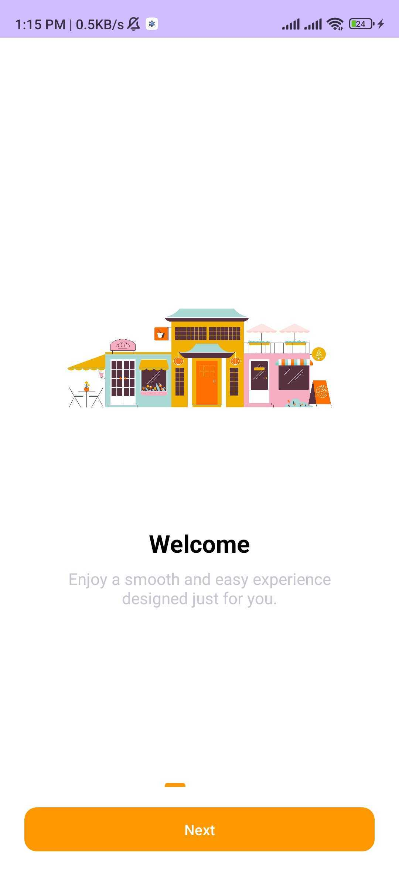
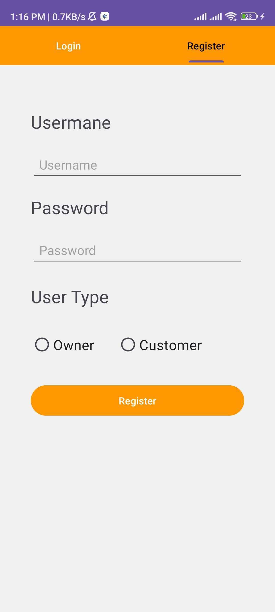
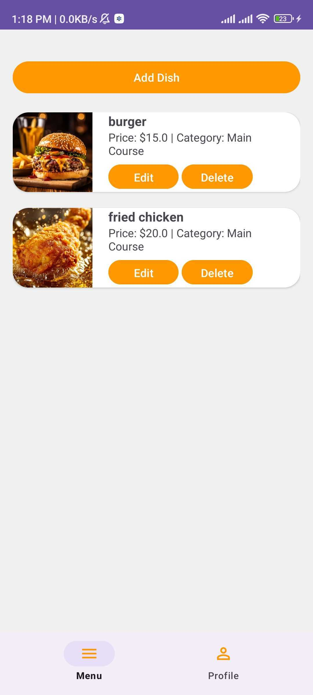
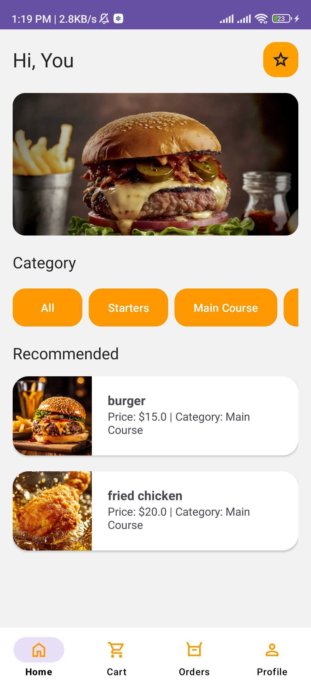
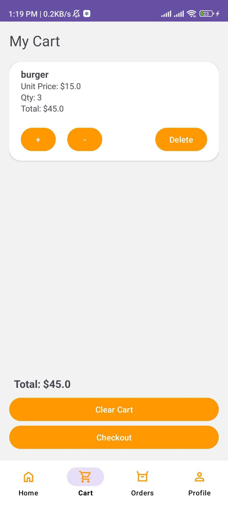
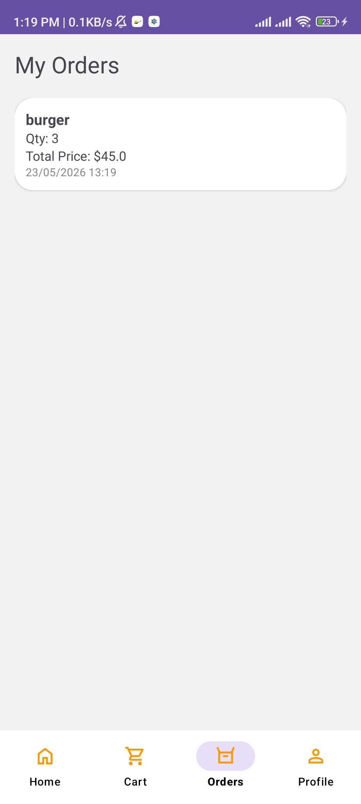
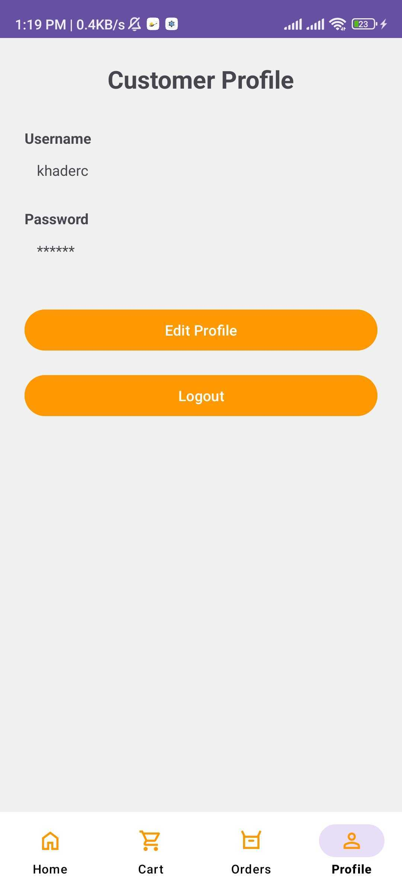

# YallaEat App 🍔

## Project Title
YallaEat - Restaurant Ordering App

---

## Project Description

YallaEat هو تطبيق موبايل يهدف لتسهيل عملية طلب الطعام من المطاعم بطريقة بسيطة وسريعة. يتيح للمستخدم تصفح الوجبات، إضافة الأصناف إلى السلة، تعديل الكميات، وإتمام الطلب بسهولة من خلال واجهات استخدام سهلة ومنظمة.

التطبيق يساعد المستخدم على الوصول للوجبات المطلوبة بسرعة ويوفر تجربة استخدام مريحة أثناء التنقل بين الصفحات وإدارة الطلبات.

---

## Main Features

- Splash Screen
- Login / Register
- عرض المطاعم والوجبات
- إضافة المنتجات إلى السلة
- تعديل كمية المنتجات
- تأكيد الطلب
- متابعة حالة الطلب

---

## Technologies Used

- Android Studio
- Java
- XML
- GitHub
- Trello

---

## Screenshots

### Splash Screen


### Onboarding Screen


### Login Screen


### Register Screen


### Owner Menu Screen


### Customer Menu Screen


### Customer Cart Screen


### Customer Order Screen


### Customer Profile Screen


---

## How to Run

1. قم بتحميل المشروع:

```bash
git clone https://github.com/your-username/YallaEat.git
```

2. افتح المشروع باستخدام Android Studio

3. انتظر حتى يتم تحميل ملفات Gradle

4. شغّل التطبيق على Emulator أو جهاز Android

5. اضغط Run

---

## Student Name

Khader Abu Shaban